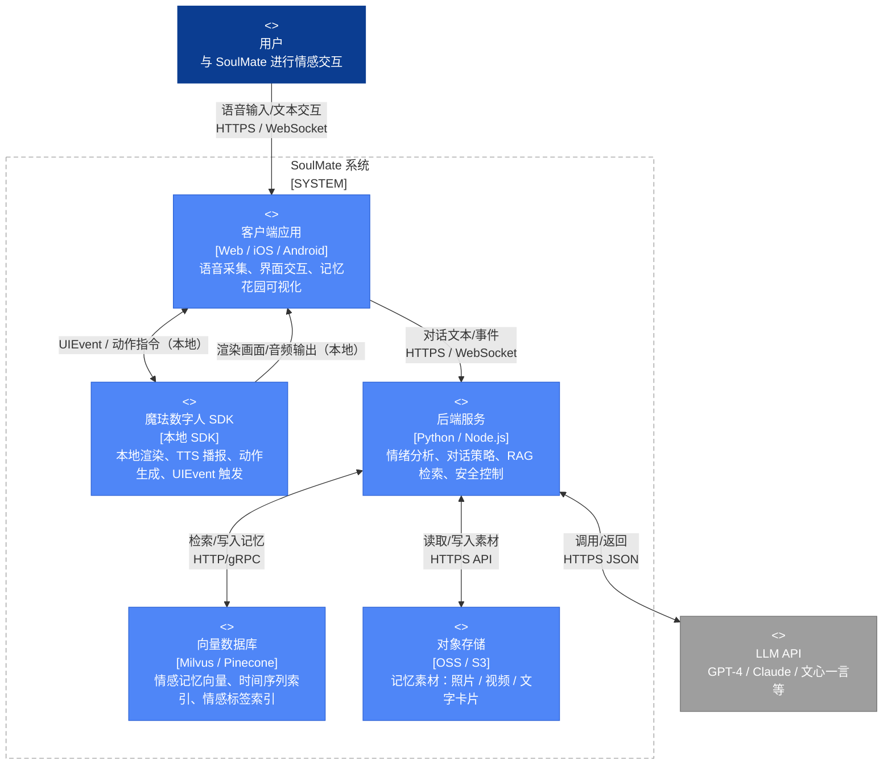
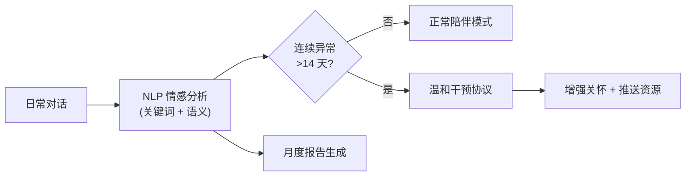
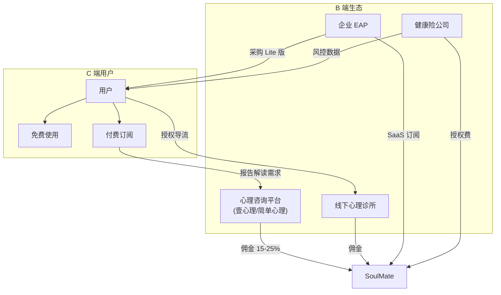

# 魔珐星云具身智能黑客松｜项目创意书（SoulMate）


---

## 一、基本信息

- **项目名称**：SoulMate（灵犀）·自适应情感伴侣  
- **参赛赛道（单选）**：创意交互（情感陪伴方向）  
- **团队名称**：SoulMate 团队（可替换）  
- **一句话介绍**：基于魔珐星云数字人平台的高拟真情感伴侣，具备**情感长时记忆（RAG）**与**主动关怀（心跳协议）**，并通过 **UIEvent 音画同步**带来“可见的回忆”。

---

## 二、项目背景与痛点

### 1. 解决什么问题？

- **情绪价值缺口**：城市青年/异地/夜间等场景下，真实陪伴稀缺，用户需要可持续的情绪支持与倾听。  
- **“金鱼记忆”AI**：多数对话产品只能记住短上下文，难以形成关系连续性与信任感。  
- **“工具感”交互**：只会文字回复，缺少具身反馈（语音语调、微表情、动作与节奏），难以“像个真实的人”。  
- **隐私焦虑**：情感对话高度私密，用户担心数据被滥用，影响长期使用与深度表达。

### 2. 目标用户是谁？

- **核心用户**：18-35 岁城市青年（孤独/压力/情绪波动频繁），希望获得稳定陪伴与被理解感。  
- **典型场景**：下班疲惫、深夜情绪低落、重要节点（生日/纪念日/面试/考试前）需要鼓励与安抚。  
- **扩展用户（可选）**：需要情感陪伴的老年人、社交障碍/焦虑人群（强调“健康引导”与边界管理）。

### 3. 核心解决方案

SoulMate 用“**记忆 + 具身 + 主动**”三件套建立真实关系感：

- **情感长时记忆（RAG）**：以“时间 + 情绪”双元数据索引构建长期记忆，支持主动回忆与关系时间线。  
- **具身化情绪反馈**：LLM 语义情感 + 语音特征（可选）融合，驱动数字人**微表情/语调/动作**自适应。  
- **心跳协议（主动关怀）**：时间/状态/情绪触发的主动互动，从“被动响应”进化为“始终在线”。  
- **记忆花园（可视化纠错）**：用户可查看/删除/修正记忆节点，降低幻觉带来的关系伤害。  
- **私有化记忆胶囊**：核心记忆加密存储与数据主权，让“隐私”转化为产品安全感卖点。

---

## 三、产品核心功能（3-5 个，突出“具身智能体验”）

- **功能点 1：实时语音对话（ASR → LLM → TTS）+ 具身回应**  
  用户开口说话后，数字人以自然语音回答，并同步输出与情绪一致的微表情与动作（点头、皱眉、轻笑、安抚手势等）。

- **功能点 2：情感长时记忆（RAG）与主动回忆**  
  记住偏好、关键事件与情绪波动；在合适时机主动提及：“你上个月说想去看海，后来成行了吗？”

- **功能点 3：心跳协议（主动关怀系统）**  
  - 时间触发：晨间唤醒/睡前关怀/纪念日提醒  
  - 状态触发：沉默检测、勿扰识别、忙碌推迟  
  - 情绪触发：连续低落预警与温和关怀

- **功能点 4：UIEvent 音画同步回忆（“看得见的记忆”）**  
  当对话触发某段回忆时，发送 UIEvent 在侧边栏弹出对应照片/视频/文字卡片，实现“说到哪，画面到哪”。

- **功能点 5：记忆花园（可视化管理与纠错）**  
  时间线浏览、记忆修剪、核心记忆锁定，用户拥有“上帝视角”确保记忆可信可控。

---

## 四、技术架构与实现

> 此部分为评估重点：说明如何使用魔珐星云平台及关键技术栈。

### 1. 技术栈规划

- **前端/终端**：Web / iOS / Android（优先移动端）+ 魔珐星云数字人 SDK（本地渲染/驱动）  
- **后端服务**：Python（FastAPI）或 Node.js（NestJS）  
- **记忆系统**：向量库（Milvus / pgvector 等）+ 元数据索引（时间/情绪/事件）  
- **大模型选用**：魔珐自带模型 / GPT / Claude / 其他开源模型（以 API 方式接入）  
- **语音链路**：ASR + TTS（优先使用魔珐/平台推荐能力，支持替换为第三方）

### 2. 魔珐星云集成方案（关键链路）

核心链路（语音驱动 + 具身输出 + UIEvent）：

```text
用户语音 → ASR(转写) → 情感/意图识别 → RAG 检索(长期记忆)
      → LLM 生成(文本 + 情绪/动作标签 + UIEvent 指令)
      → TTS(合成) → 魔珐数字人播报/动作驱动 + UIEvent 音画同步展示
```

- **UIEvent 协议**：参考 SDK `demo_speak_value.txt` 配置逻辑，将“回忆触发点”映射为 UI 事件（展示照片/视频/卡片/时间线节点）。  
- **具身动作驱动**：LLM 输出结构化标签（emotion=安心/开心/担忧；gesture=点头/拥抱手势等），由客户端/SDK 映射到具体表情与动作库。  
- **主动关怀调度**：端侧（WorkManager/BackgroundTasks）+ 服务端策略（推送窗口/频率控制）结合，避免打扰与过度依赖。

### 3. 架构草图（可选）



---

## 五、情感健康守护与 B 端生态（Killer Feature）

> **核心定位**：SoulMate 不只是陪伴，更是**"心理健康的第一道防线"**。我们每天都在，医生每月才见一次——早期信号，我们先捕捉。

### 1. MindWatch System（心灵哨兵系统）

#### 1.1 运作机制

| 层级 | 功能 | 说明 |
|------|------|------|
| **被动监测** | 长期对话模式分析 | 静默追踪关键词频率（如"累""没意思""失眠""不想动"）、对话情绪曲线、互动时长变化，不打扰用户日常体验 |
| **智能预警** | 温和干预协议 | 若检测到连续 **>14 天**呈现中度及以上抑郁倾向，系统自动触发"温和干预"：增加主动关怀频率、引导正向对话、推送专业资源入口 |
| **可视报告** | 月度情感健康报告 | 生成心情趋势图、关键事件时间线、情绪波动热力图；用户可自主导出 PDF，用于自我觉察或与心理咨询师沟通 |



#### 1.2 隐私与伦理边界

- **用户主权**：所有监测**默认关闭**，需用户主动开启"心灵守护"功能
- **数据最小化**：仅提取情绪标签与趋势，不存储原始对话用于此功能
- **危机熔断**：出现自残/自杀关键词时，立即熔断并推送专业求助热线（如：全国心理援助热线 400-161-9995）

---

### 2. 商业模式（B2C2B 飞轮）

#### 2.1 B2C（用户侧）

| 层级 | 内容 | 对标竞品 |
|------|------|----------|
| **免费版** | 基础陪伴 + 简版月度情绪摘要 | — |
| **高级订阅** | 详细心理分析报告、历史趋势对比、个性化建议、专属心理测评 | Headspace / Calm / Wysa |
| **付费增值** | 专业心理咨询师解读报告（一对一 15 分钟） | 壹心理 / 简单心理 |

#### 2.2 B2B（企业/机构侧）

| 模式 | 描述 | 收入来源 |
|------|------|----------|
| **导流分成** | 用户授权后，无缝对接合作心理咨询平台（壹心理、简单心理）或线下心理诊所，按成功转化收取 **15-25% 佣金** | CPS 分成 |
| **EAP 企业版** | 向企业出售"员工心灵守护 Lite"：匿名化情绪监测仪表盘、团队心理健康趋势报告、预警触发 HR 介入机制 | SaaS 订阅（按席位/年） |
| **保险合作** | 与健康险公司合作，作为"心理健康风险评估"数据源，降低承保风险 | 数据授权费 |



---

### 3. 战略叙事："第一道防线"

> **"医生是治疗者，SoulMate 是守望者。"**

| 维度 | 传统心理服务 | SoulMate |
|------|--------------|----------|
| **触达频率** | 每月 1-2 次 | **每天、每时** |
| **介入时机** | 用户主动求助 | **被动监测、主动关怀** |
| **数据连续性** | 单次问诊快照 | **长期情绪时间线** |
| **用户心理门槛** | 高（承认"我需要帮助"） | **低（只是和朋友聊天）** |
| **成本** | ¥300-800/次 | **免费 / ¥15-30/月** |

**核心价值主张**：

- 我们不是替代心理医生，而是**前置筛查**——在用户意识到问题之前，我们已经在默默守护。
- 每一次"今天感觉怎么样？"的主动关怀，都是一次**低成本、高频次的心理触诊**。
- 当真正的危机信号出现时，我们是**最快响应的第一环**，将用户无缝交接给专业力量。

> [!IMPORTANT]
> **合规声明**：MindWatch 系统不提供任何医疗诊断，仅作为情绪趋势参考工具。所有"干预"行为仅限于增强陪伴与资源推送，不替代专业心理咨询或治疗。

---

## 六、资源需求评估

### 1. 预计 LLM 调用量级

- **目标规模（可调整）**：黑客松 Demo + 小范围内测 200 DAU  
- **交互频次假设**：人均 10-15 轮/天（包含少量主动关怀触发）  
- **调用量估算**：约 2,000 - 3,500 次/天（按“每轮一次生成”估算）  
- **Token 估算（粗略）**：约 200 万 - 700 万 Token/天（取决于上下文长度、RAG 命中率与是否输出结构化动作/UIEvent 标签）

### 2. ASR/TTS 需求

- **语音时长假设**：人均 2-4 分钟/天（以语音为主的沉浸交互，文字为辅）  
- **总量估算**：约 7 - 14 小时语音/天（200 DAU）  
- **质量要求**：低延迟（交互感关键）、情绪化 TTS（更拟人）、支持多音色与语速语调控制

### 3. 其他特殊需求

- **向量存储**：每用户日均 20-30 轮对话；长期留存需分层（短期原文/中期摘要/长期事件）以控成本  
- **对象存储**：记忆素材（照片/视频/卡片）用于 UIEvent 展示  
- **隐私与合规**：记忆加密、数据导出/删除、危机干预围栏（自残/自杀关键词熔断并引导专业求助）

---

## （可选补充）我们最重要的差异化一句话

**SoulMate 不是“会说话的数字人”，而是“会记得、会主动、并能用具身表达去陪伴”的长期关系型 AI。**